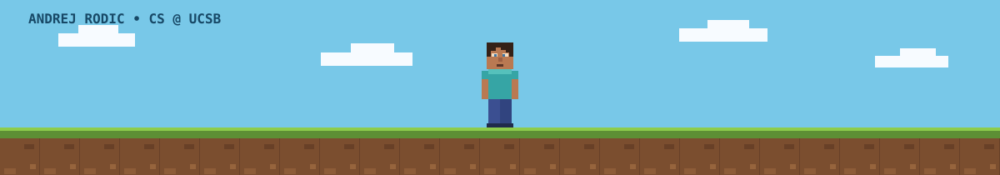

---

### ⛏️ `whoami`

Hey, I am **Andrej** - a **freshman studying Computer Science** at **UC Santa Barbara**. I learn best by building: turning small everyday problems into practical projects with code, electronics, and design.

When I am not working on a project, I am usually experimenting with 3D-print ideas or learning how to communicate an idea more clearly through video and design.

---

### 🧱 `inventory`

- **Foundations:** Java, object-oriented programming, and algorithms
- **Hardware:** microcontrollers, sensors, LEDs, and laser timing
- **Design:** 3D modeling, 3D printing, and iterative prototyping
- **Creative work:** video editing, thumbnail design, and storytelling

---

### 🔥 `active quests`

- Building my computer science foundation at **UCSB**
- Making software and electronics projects that solve small, real problems
- Learning to document my work clearly and share the process behind it

---

### 🗺️ `project log`

| Build | Notes |
| :-- | :-- |
| 🚗 **Garage Parking Sensor** | Built a microcontroller, distance-sensor, and LED setup to signal the right parking distance. |
| ⚡ **DIY Sprint Speed Gates** | Created a lower-cost laser-sensor timing setup for sprint training. |
| 🧩 **3D Print Studio** | Designed, printed, and sold 240+ functional items; improved designs from customer feedback. |
| 🛒 **Online Marketplace Operations** | Ran an eBay storefront, handling customers, returns, pricing, and performance tracking. |

---

### 💎 `achievements`

| Focus | Milestone |
| :-- | :-- |
| **Peer mentoring** | Three years helping students with math and other subjects, study strategies, and test preparation. |
| **Tutoring initiative** | Organized an after-school event, designed recruitment posters, and formed study groups around students' needs. |
| **National Honor Society** | Helped organize a clothing drive for the Trinity Center and other service efforts. |
| **Community** | Volunteered with Animal Rescue of Tracy. |
| **Creative work** | Built a YouTube art/customization channel and developed video-editing and thumbnail-design skills. |

---

### 🌿 `lore`

- **240+** 3D-printed items sold
- **$5.6k** in eBay sales with **217** positive reviews
- Varsity soccer, National Honor Society, community service, and mentoring

---

<picture>
  <source media="(prefers-color-scheme: dark)" srcset="./dist/github-contribution-grid-snake-dark.svg" />
  <source media="(prefers-color-scheme: light)" srcset="./dist/github-contribution-grid-snake.svg" />
  
</picture>

*last updated by GitHub Actions*

