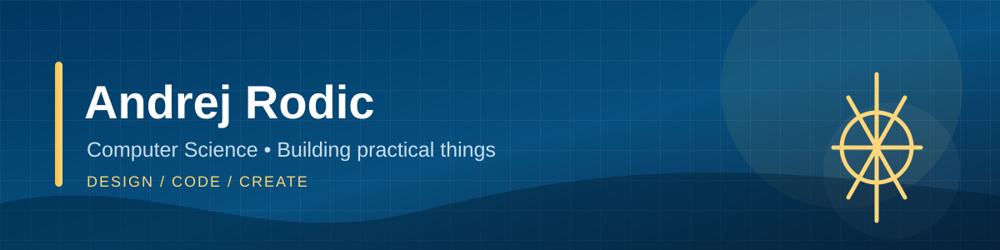

  

  <b>Incoming Computer Science student at UC Santa Barbara</b> 
  I enjoy turning everyday problems into practical projects through code, electronics, and design.

<!-- Add real links here when ready:
[LinkedIn](https://www.linkedin.com/in/your-handle) • [YouTube](https://youtube.com/@your-handle) • [Portfolio](https://your-site.example)
-->

---

### Who I am

I'm Andrej, an incoming computer science student who likes learning by building. My projects usually start with a real problem around me - from helping my family park in the garage to building a lower-cost way for my brother to time his sprints.

I care about the full process: understanding the problem, designing a solution, testing it, and improving it from feedback.

### Inventory

| Area | Tools and experience |
| :-- | :-- |
| Languages & foundations | Java, object-oriented programming, algorithms |
| Hardware & building | Microcontrollers, sensors, LEDs, laser timing |
| Design & making | 3D modeling, 3D printing, iterative prototyping |
| Creative work | Video editing, thumbnail design, storytelling |

### Featured builds

| Project | What I built | Focus |
| :-- | :-- | :-- |
| 🚗 **Garage Parking Sensor** | A microcontroller, distance sensor, and LED setup that signals when a driver has reached the right parking distance. | Embedded systems, problem solving |
| ⚡ **DIY Sprint Speed Gates** | A lower-cost timing setup using laser sensors and a microcontroller for sprint training. | Hardware, testing, iteration |
| 🧩 **3D Print Studio** | Designed, printed, and sold 240+ functional items, including organizers and custom parts, while refining models from customer feedback. | CAD, prototyping, customer feedback |
| 🛒 **Online Marketplace Operations** | Ran an eBay storefront: communicated with customers, handled returns, adjusted pricing, and tracked performance. | Operations, communication, analytics |

### Community & milestones

- **Peer mentoring:** Spent three years helping students with math and other subjects, adapting study strategies and test practice to build confidence.
- **Tutoring initiative:** Organized an after-school tutoring event, designed recruitment posters, and helped form study groups around students' needs.
- **National Honor Society:** Helped organize a clothing drive for the Trinity Center and other community-service efforts.
- **Community projects:** Volunteered with Animal Rescue of Tracy and helped host an Asian-discrimination awareness week at school.
- **Creative work:** Built a YouTube art/customization channel, learning video editing, thumbnail design, and audience analysis.

### Numbers

| 240+ | $5.6k | 217 | 3 years |
| :-- | :-- | :-- | :-- |
| 3D-printed items sold | eBay sales | positive eBay reviews | peer mentoring |

### Currently exploring

- Expanding my computer science foundation at UC Santa Barbara
- Building more software and electronics projects that solve small, real problems
- Learning how to document projects clearly and share the process behind them

---

  <i>Design • Code • Create</i>

